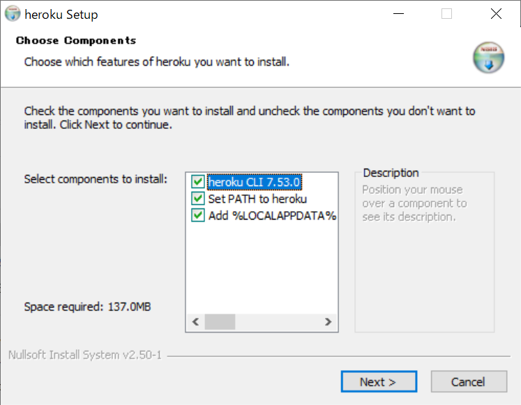

# GitHubのREADME.mdで使用できる画像の装飾

## 中央寄せ
```markdown
<div align="center">
    
</div>
```
<div align="center">
    
</div>

<br>

## 枠
```markdown
||
|:-:|
```
||
|:-:|

<br>

```markdown
<kbd></kbd>

```
<kbd></kbd>

<br>

## 使えなかった
### styleタグ
```markdown
<style>
img {
    border: 1px red solid;
}
</style>

```
